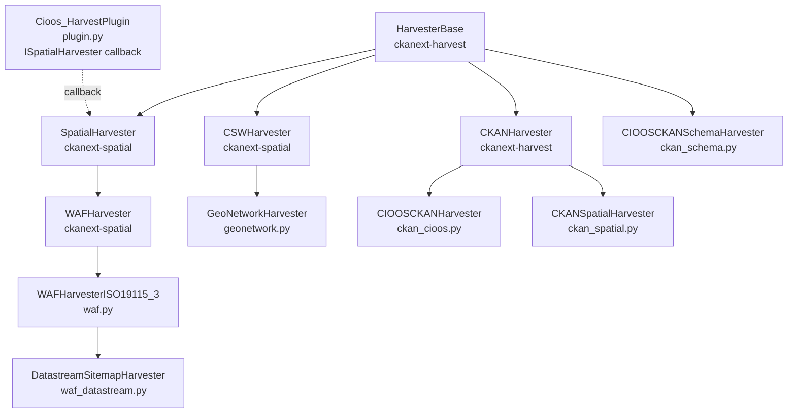
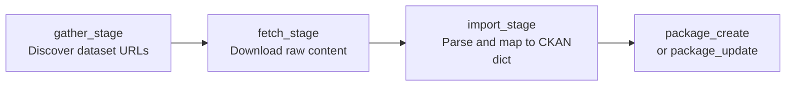

# ckanext-cioos_harvest

CIOOS-SIOOC harvest extension for CKAN. Extends `ckanext-harvest` and
`ckanext-spatial` with CIOOS-specific metadata handling for the
`scheming`, `fluent`, and `composite` extensions used by the CIOOS
data catalogue.

## What It Does

During the harvest import stage, the extension:

- Parses ISO 19115-3 XML metadata via a custom functional lxml
  parser (replacing ckanext-spatial's default ISO 19139 parser)
- Moves scheming fields from `extras` into the package root
- Ensures list and multi-list scheming field values are stored
  as lists rather than strings
- Places composite and composite-repeating fields into `__extras`
  where the composite extension expects them
- Flattens nested composite keys into concatenated field names
  (e.g. `{code: x}` becomes `field_code: x`)
- Converts fluent tag fields into `{lang: [values]}` dictionaries
- Populates fluent fields with the default language when no
  language dictionary is provided
- Matches and creates organizations and groups from harvested
  metadata (responsible organisations mapped to CKAN groups)
- Translates multilingual resource name/description fields

## Harvesters

This extension provides seven CKAN plugins — one ISpatialHarvester
callback plugin and six harvester types:

### ISpatialHarvester Plugin

| Plugin Name | Class | Description |
|---|---|---|
| `cioos_harvest` | `Cioos_HarvestPlugin` | ISpatialHarvester callback; post-processes spatial harvester results with CIOOS schema mapping |

### Harvester Plugins

| Plugin Name | Class | Source | Description |
|---|---|---|---|
| `waf_iso19115_3_harvester` | `WAFHarvesterISO19115_3` | `harvesters/waf.py` | Primary CIOOS harvester — WAF index of ISO 19115-3 XML files |
| `cioos_datastream_harvester` | `DatastreamSitemapHarvester` | `harvesters/waf_datastream.py` | DataStream ISO 19115-2 via sitemap.xml, with AWS Translate |
| `ckan_cioos_harvester` | `CIOOSCKANHarvester` | `harvesters/ckan_cioos.py` | CKAN-to-CKAN with field filtering, org matching by URI |
| `ckan_spatial_harvester` | `CKANSpatialHarvester` | `harvesters/ckan_spatial.py` | CKAN-to-CKAN filtered by spatial query (WKT polygon/bbox) |
| `ckan_schema_harvester` | `CIOOSCKANSchemaHarvester` | `harvesters/ckan_schema.py` | CKAN-to-CKAN without requiring a matching schema |
| `cioos_geonetwork_harvester` | `GeoNetworkHarvester` | `harvesters/geonetwork.py` | GeoNetwork CSW catalogue with topic-to-group mapping |

### Class Hierarchy



### Pipeline Stages

Every harvester implements three stages, run asynchronously via
the harvest queue:



1. **gather_stage** — Discovers datasets at the remote source;
   returns a list of `HarvestObject` IDs (one per dataset).
2. **fetch_stage** — Downloads the content for each
   `HarvestObject`; stores raw content in `HarvestObject.content`.
3. **import_stage** — Parses the content and creates/updates the
   CKAN package via `package_create` or `package_update`.

## File Structure

```
ckanext/cioos_harvest/
  plugin.py                  # Cioos_HarvestPlugin (ISpatialHarvester + IConfigurer + ITemplateHelpers)
  harvesters/
    __init__.py              # Re-exports all harvester classes
    base.py                  # Shared utilities, exceptions, singleton pattern
    field_handlers.py        # Unified fluent/composite/scheming field handlers
    waf.py                   # WAFHarvesterISO19115_3 (ISO 19115-3 WAF)
    waf_datastream.py        # DatastreamSitemapHarvester (DataStream ISO 19115-2)
    ckan_cioos.py            # CIOOSCKANHarvester (CKAN-to-CKAN)
    ckan_spatial.py          # CKANSpatialHarvester (CKAN + spatial filter)
    ckan_schema.py           # CIOOSCKANSchemaHarvester (schema-agnostic CKAN)
    geonetwork.py            # GeoNetworkHarvester (CSW/GeoNetwork)
  model/
    iso19115_3.py            # Functional lxml parser for ISO 19115-3 XML
  helpers.py                 # Template helper functions
  logic.py                   # Custom CKAN actions (spatial_query_geo)
  templates/                 # Harvest UI templates
  tests/
    test_iso19115_3.py       # Golden-file tests (XML → package dict)
    conftest.py              # Test configuration and fixtures
    fixtures/
      iso19115_3/
        00-xml/              # Input XML fixtures
        01-ckan-package/     # Expected package dict golden files
```

## Requirements

- CKAN 2.11+
- ckanext-harvest
- ckanext-spatial
- ckanext-scheming
- ckanext-fluent

## Configuration

### ckan.ini

Set timeout for `request.get` when reading full XML body from a
URL (used by the CIOOS CKAN harvester):

```ini
ckan.index_xml_url_read_timeout = 500
```

### Harvest Source Config

Per-source configuration is set as JSON in the harvest source
configuration field. All fields are optional.

**Common options (all harvesters):**

```json
{
  "url_read_timeout": 500,
  "clean_tags": false,
  "organization_mapping": {},
  "data_catalogue_source": []
}
```

**CIOOSCKANHarvester additional options:**

```json
{
  "field_filter_include": ["field1", "field2"],
  "field_filter_exclude": ["field3"],
  "api_key": "your-api-key"
}
```

Note: `field_filter_include` and `field_filter_exclude` are mutually
exclusive.

**CKANSpatialHarvester additional options:**

```json
{
  "spatial_filter": "POLYGON((...)) or BOX(...)",
  "spatial_filter_file": "/path/to/wkt/file",
  "spatial_crs": 4326
}
```

## Installation

This extension is installed automatically when mounted into the
CIOOS CKAN Docker development container via the `src/` directory.

For manual installation:

1. Activate your CKAN virtual environment
2. Install the package:

   ```shell
   pip install -e 'git+https://github.com/cioos-siooc/ckanext-cioos_harvest.git#egg=ckanext-cioos_harvest'
   ```

3. Add the plugins to `ckan.plugins` in your CKAN config:

   ```ini
   ckan.plugins = ... cioos_harvest waf_iso19115_3_harvester ckan_cioos_harvester
   ```

4. Restart CKAN

## Running Tests

Tests require the full CKAN stack (PostgreSQL, Solr, Redis) running
via Docker Compose.

```bash
# Run all harvester tests
just harvest-test -vv

# Run only parser tests (XML parsing, no CKAN stack needed)
just harvest-test -vv -k parser

# Run only package dict tests (full pipeline, needs CKAN stack)
just harvest-test -vv -k package

# Regenerate golden files after intentional pipeline changes
just harvest-test -- --regenerate-fixtures
```

Golden files live in `tests/fixtures/iso19115_3/`. If a JSON file
is missing, the test auto-generates it and skips; review the file
then re-run to validate.

## License

AGPL v3.0 or later
